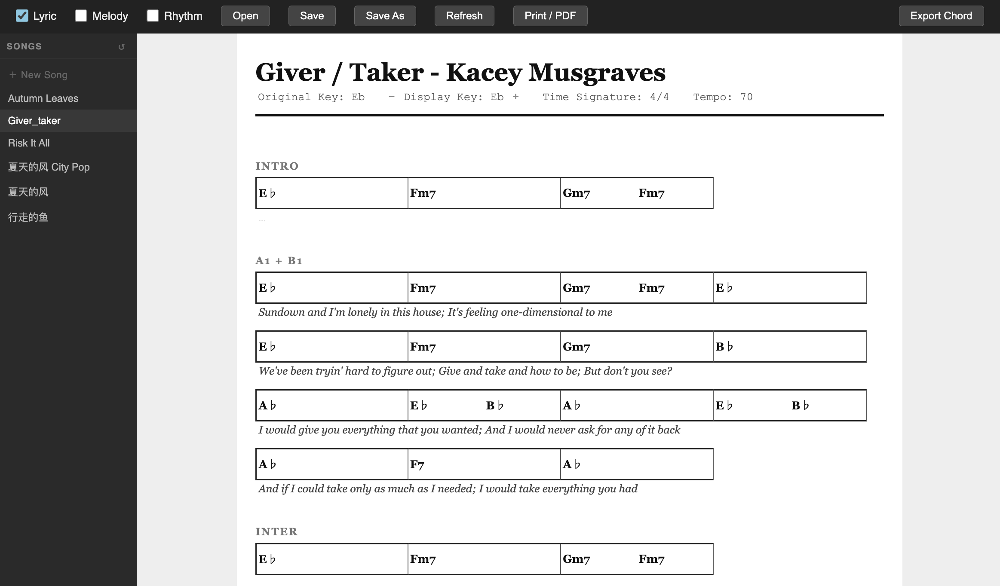

# TranscriptionHelper



A local web application for transcribing and editing music charts. Built with React + TypeScript + Vite, TranscriptionHelper uses a custom `.chart` text format to represent chord progressions, lyrics, melody notes, and rhythm patterns in a clean, human-readable way.

## Features

### Chord Grid
- Grid-based chord entry with measures and beats
- Inline editing with click-to-edit slots
- Tab / Shift+Tab navigation across slots, rows, and sections
- Add, delete, and rearrange measures per row
- Chord normalization for storage (`m7b5` -> `o/`, `maj7` -> `M7`) and display (`o/` -> `ø`, `b` -> `♭`, `#` -> `♯`)

### Rhythm Grid
- 8-subdivision rhythm grid per measure (supports 4/4 time)
- Click to cycle through symbols: `-` (rest), `B` (bass), `O` (open), `x` (ghost)
- Right-click to subdivide a cell into 2 or 3 parts (for swing, triplets, etc.)
- Right-click again on a 3-split cell to collapse back to single
- Clear rhythm button per row to reset all slots to rest

### Lyrics & Melody
- Optional lyric and melody lines per chord row
- Click-to-edit inline editing
- Toggle visibility from the toolbar

### Key Transposition
- Transpose all chords up or down by semitone with `+` / `−` buttons
- Automatic sharp/flat spelling based on target key
- Preserves original key for reference

### Section Management
- Add, delete, rename, merge, and split sections
- Merge sections up/down to combine rows
- Split a row to create a new section boundary

### File Management
- Sidebar listing all `.chart` files in the `songs/` directory
- Create new songs with a title
- Delete songs with confirmation
- Auto-save on window blur
- Save with `Cmd+S` / `Ctrl+S` (with toast notification)
- Save As with file picker dialog
- Open files via file picker or sidebar
- Refresh to reload from disk
- Export chords as plain text (`.txt`)
- Print / PDF export via browser print

## Getting Started

### Prerequisites
- [Node.js](https://nodejs.org/) (v18+)
- npm

### Installation

```bash
npm install
```

### Running

```bash
npm run dev
```

Open the URL shown in the terminal (usually `http://localhost:5173`).

### Building for Production

```bash
npm run build
npm run preview
```

## The `.chart` File Format

TranscriptionHelper uses a custom plain-text format. Files are stored in the `songs/` directory.

### Example

```
title: Autumn Leaves
originalKey: Gm
key: Gm
time: 4/4
tempo: 120

[A]
chord:
| Cm7    | F7     | BbM7   | EbM7   |
| Ao/    | D7     | Gm     | Gm     |

lyric:
The falling leaves drift by my window
The autumn leaves of red and gold

rhythm:
| B - O - B - O - | B - O - B - O - | B - O - B - O - | B - O - B - O - |
| B - O - B - O - | B - O - B - O - | B - O - B - O - | B - O - B - O - |
```

### Format Reference

**Metadata** (before any section):
| Field | Description |
|-------|-------------|
| `title` | Song title |
| `originalKey` | Original key (preserved during transposition) |
| `key` | Current display key |
| `time` | Time signature, e.g. `4/4` |
| `tempo` | BPM |

**Sections** start with `[SectionName]` and contain blocks:

- `chord:` — Measures separated by `|`, slots separated by spaces. `-` means sustain/rest.
- `lyric:` — One line per chord row. `-` means empty line.
- `melody:` — One line per chord row. `-` means empty line.
- `rhythm:` — 8 slots per measure. Symbols: `B` (bass), `O` (open), `x` (ghost), `-` (rest). Subdivisions: `(B,O)` for 2-way, `(B,O,x)` for 3-way.

Only `chord:` is required; `lyric:`, `melody:`, and `rhythm:` are optional.

## Keyboard Shortcuts

| Shortcut | Action |
|----------|--------|
| `Cmd/Ctrl + S` | Save file in place |
| `Tab` | Move to next chord slot / next row |
| `Shift + Tab` | Move to previous chord slot / previous row |
| `Enter` | Commit edit |
| `Escape` | Cancel edit |

## Project Structure

```
src/
├── components/
│   ├── ChordGrid.tsx      # Chord grid display and editing
│   ├── RhythmGrid.tsx     # Rhythm pattern grid
│   ├── SongView.tsx       # Main song layout and section management
│   └── FileSidebar.tsx    # File browser sidebar
├── parser/
│   ├── types.ts           # Data model (Song, Section, ChordMeasure, etc.)
│   ├── parse.ts           # .chart file parser
│   └── serialize.ts       # .chart file serializer
├── styles/
│   └── global.css         # Global styles and print layout
└── App.tsx                # Root component, state management, file I/O
songs/                     # .chart files directory
vite.config.ts             # Dev server with API middleware
```

## Tech Stack

- **React 19** with TypeScript
- **Vite** for dev server and build
- Custom Vite middleware for local file API (`/api/songs`, `/api/load`, `/api/save`, `/api/delete`)
- File System Access API (browser-native) as fallback for Save As / Open
- localStorage for persisting last opened file
- CSS Grid for chord and rhythm layouts
- No external UI libraries

---

## 中文说明

# TranscriptionHelper - 音乐转谱助手

一个本地运行的音乐转谱和编辑工具。使用 React + TypeScript + Vite 构建，采用自定义的 `.chart` 纯文本格式来记录和弦进行、歌词、旋律和节奏型。

## 主要功能

### 和弦网格
- 网格化的和弦输入，支持小节和拍的概念
- 点击即可编辑，Tab / Shift+Tab 在格子间导航
- 支持添加、删除小节
- 和弦自动规范化存储（`m7b5` -> `o/`，`maj7` -> `M7`），显示时自动美化（`o/` -> `ø`，`b` -> `♭`，`#` -> `♯`）

### 节奏网格
- 每小节 8 个细分格，支持 4/4 拍
- 点击循环切换符号：`-`（休止）、`B`（低音）、`O`（开放）、`x`（幽灵音）
- 右键点击可将一个格子细分为 2 份或 3 份（用于摇摆、三连音等）
- 每行提供清除节奏按钮，一键重置为全休止

### 歌词与旋律
- 每行和弦下方可附加歌词和旋律行
- 点击即可编辑，可从工具栏切换显示/隐藏

### 移调功能
- 通过 `+` / `−` 按钮按半音升降调
- 自动根据目标调号选择升降号拼写
- 保留原始调号供参考

### 段落管理
- 添加、删除、重命名段落
- 上下合并段落、拆分段落
- 灵活的行管理（添加、删除、拆分行）

### 文件管理
- 侧边栏显示 `songs/` 目录下的所有 `.chart` 文件
- 新建、删除歌曲（删除前确认）
- 窗口失焦时自动保存
- `Cmd+S` / `Ctrl+S` 保存（带提示）
- 另存为、打开文件、刷新
- 导出和弦为纯文本（`.txt`）
- 通过浏览器打印导出 PDF

## 快速开始

```bash
# 安装依赖
npm install

# 启动开发服务器
npm run dev
```

在浏览器打开终端显示的地址（通常是 `http://localhost:5173`）即可使用。

## `.chart` 文件格式

```
title: 歌曲名称
key: C
time: 4/4
tempo: 120

[前奏]
chord:
| C      | Am     | F      | G      |

lyric:
-

rhythm:
| B - O - B - O - | B - O - B - O - | B - O - B - O - | B - O - B - O - |
```

- **元数据**：`title`（标题）、`key`（调号）、`time`（拍号）、`tempo`（速度）
- **段落**：以 `[段落名]` 开头
- **和弦**（`chord:`）：用 `|` 分隔小节，空格分隔拍，`-` 表示延续
- **歌词**（`lyric:`）：每行对应一行和弦，`-` 表示空行
- **节奏**（`rhythm:`）：每小节 8 格，`B`/`O`/`x`/`-`，细分用 `(B,O)` 或 `(B,O,x)` 表示
